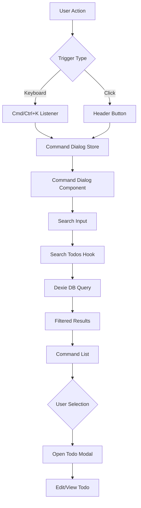

# Command Dialog Implementation Plan

## Overview
Create a command palette dialog component that allows users to search todos by title and description, with keyboard shortcut support (Cmd/Ctrl+K) and integration with the existing todo modal.

## Architecture



## Components to Create

### 1. Command Dialog Store (`src/stores/command-dialog-store.ts`)
- Manage open/close state
- Store search query
- Store selected todo

### 2. Search Todos Hook (`src/hooks/use-search-todos.ts`)
- Query Dexie database for todos
- Filter by title and description
- Debounce search input
- Return filtered results

### 3. Command Dialog Component (`src/components/command-dialog/command-dialog.tsx`)
- Use existing `CommandDialog` from `@/components/ui/command`
- Display search input
- Show No Todos Found id input has text and notodos
- Show filtered todo results
- Handle keyboard navigation
- Open todo modal on selection

### 4. Keyboard Shortcut Hook (`src/hooks/use-keyboard-shortcut.ts`)
- Listen for Cmd/Ctrl+K
- Toggle command dialog
- Prevent default browser behavior

### 5. Update Header Component (`src/components/layout/header.tsx`)
- Add search button trigger
- Integrate with command dialog store

## Implementation Details

### Command Dialog Store
```typescript
type CommandDialogStore = {
  open: boolean
  setOpen: (open: boolean) => void
  toggle: () => void
}
```

### Search Logic
- Search in both `title` and `description` fields
- Case-insensitive matching
- Return all matching todos sorted by relevance
- Show No Todos Found when no results found

### UI Components
- Use existing `Command`, `CommandInput`, `CommandList`, `CommandItem` from cmdk
- Display todo title, description preview, priority badge
- Show project indicator if applicable
- Keyboard navigation support (arrow keys, enter, escape)

### Integration Points
- Reuse existing `todo-modal` for displaying/editing selected todos
- Use `setTodotoEdit` from `todo-model` store
- Maintain consistent styling with existing components

## File Structure
```
src/
├── components/
│   ├── command-dialog/
│   │   └── command-dialog.tsx
│   └── layout/
│       └── header.tsx (modified)
├── hooks/
│   ├── use-keyboard-shortcut.ts (new)
│   └── use-search-todos.ts (new)
└── stores/
    └── command-dialog-store.ts (new)
```

## Key Features
1. **Keyboard Shortcut**: Cmd/Ctrl+K to open/close
2. **Real-time Search**: Filter as user types
3. **Multi-field Search**: Search title and description
4. **Quick Actions**: Select todo to open in modal
5. **Keyboard Navigation**: Arrow keys, Enter, Escape
6. **Empty States**: Helpful messages when no results
7. **Responsive Design**: Works on all screen sizes

## Dependencies
- `cmdk` (already installed)
- `zustand` (already installed)
- `dexie` (already installed)
- `dexie-react-hooks` (already installed)

## Testing Checklist
- [ ] Keyboard shortcut opens dialog
- [ ] Search filters todos correctly
- [ ] Selecting todo opens modal
- [ ] Escape closes dialog
- [ ] Click outside closes dialog
- [ ] Empty state displays correctly
- [ ] Keyboard navigation works
- [ ] Header button triggers dialog
