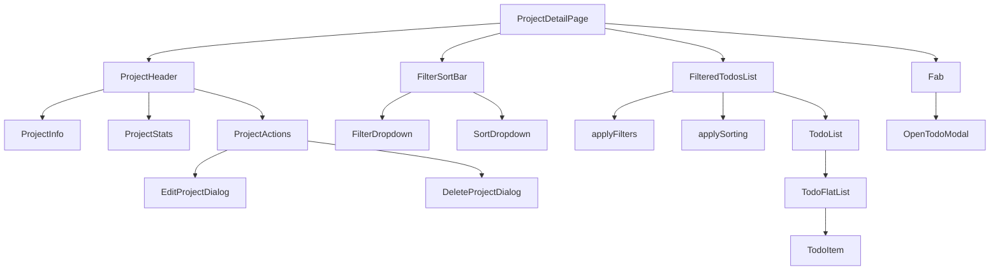
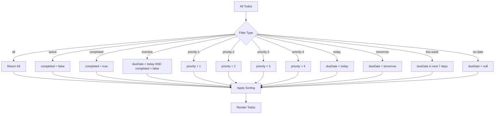
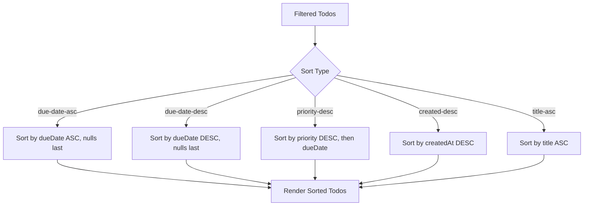

# Project Detail Page Implementation Plan

## Overview
The project detail page at `src/routes/(todo)/project/$id.tsx` will display a specific project with all its associated todos, including filtering, sorting, and statistics features.

## Page Structure

```
┌─────────────────────────────────────────────────────────┐
│  Project Header (sticky)                                  │
│  ┌─────────────────────────────────────────────────────┐ │
│  │  🎯 Project Name                    [Edit] [Delete]   │ │
│  │  Stats: 12 tasks | 8 done | 2 overdue | 2 pending    │ │
│  │  Progress: ████████░░ 67%                             │ │
│  └─────────────────────────────────────────────────────┘ │
├─────────────────────────────────────────────────────────┤
│  Filter & Sort Bar                                        │
│  ┌─────────────────────────────────────────────────────┐ │
│  │  [Filter: All ▼] [Sort: Due Date ▼]                 │ │
│  └─────────────────────────────────────────────────────┘ │
├─────────────────────────────────────────────────────────┤
│  Project Todos List (filtered/sorted)                     │
│  ┌─────────────────────────────────────────────────────┐ │
│  │  ☐ Task 1                    [Due: Today] [P1]     │ │
│  │  ☐ Task 2                    [Due: Tomorrow] [P2]   │ │
│  │  ☑ Completed Task            [Completed]            │ │
│  └─────────────────────────────────────────────────────┘ │
│  [Empty State - if no todos match filters]               │
├─────────────────────────────────────────────────────────┤
│  [+ FAB Button] (bottom right)                           │
└─────────────────────────────────────────────────────────┘
```

## Implementation Steps

### 1. Route Setup & Data Fetching
- Extract `id` parameter from TanStack Router
- Query project details from `db.projects` using `useLiveQuery`
- Query ALL todos for the project using `useLiveQuery` with `projectId` filter
- Handle loading states with skeleton components
- Handle 404 state when project doesn't exist

### 2. Project Header Component with Statistics
- Display project icon (emoji) and name
- **Statistics Bar:**
  - Total tasks count
  - Completed tasks count
  - Overdue tasks count
  - Pending tasks count
  - Progress bar (completed/total)
- Add edit button to open project edit modal/dialog
- Add delete button with confirmation
- Use sticky positioning like other pages

### 3. Filter & Sort Controls
- **Filter Dropdown:**
  - All tasks
  - Active (not completed)
  - Completed
  - Overdue
  - By Priority (P1, P2, P3, P4)
  - By Due Date (Today, Tomorrow, This Week, No Date)
- **Sort Dropdown:**
  - Due Date (ascending/descending)
  - Priority (highest first)
  - Created Date (newest first)
  - Title (A-Z)

### 4. Filtered & Sorted Todos List
- Apply client-side filtering based on selected filter
- Apply client-side sorting based on selected sort option
- **Use `TodoList` component** from `@/components/todo/todo-list` for displaying todos
- Show empty state when no todos match filters
- Include "Clear filters" button when filters are active

### 5. Floating Action Button (FAB)
- Position fixed at bottom-right
- Opens todo modal with `projectId` pre-filled
- Reuse existing `Fab` component
- Connect to `openTodoModel` store action

### 6. Project Edit/Delete Functionality
- Create project edit dialog (similar to todo modal)
- Form fields: name, icon (emoji picker)
- Delete confirmation dialog
- Update `db.projects` using existing service functions

### 7. State Management for Filters/Sort
- Create local state for:
  - `filterType`: 'all' | 'active' | 'completed' | 'overdue' | 'priority-1' | 'priority-2' | 'priority-3' | 'priority-4' | 'today' | 'tomorrow' | 'this-week' | 'no-date'
  - `sortType`: 'due-date-asc' | 'due-date-desc' | 'priority-desc' | 'created-desc' | 'title-asc'
- Persist filter/sort preferences to localStorage (optional)

## Component Architecture



## Filter Logic



## Sort Logic



## Statistics Calculation

```typescript
const stats = {
  total: todos.length,
  completed: todos.filter(t => t.completed).length,
  overdue: todos.filter(t => !t.completed && t.dueDate && isPast(t.dueDate)).length,
  pending: todos.filter(t => !t.completed).length,
  progress: (completed / total) * 100
}
```

## Data Fetching with useLiveQuery

```typescript
import { useLiveQuery } from 'dexie-react-hooks'
import { db } from '@/lib/db'

// Get project details
const project = useLiveQuery(() => db.projects.get(Number(id)), [id])

// Get all todos for this project
const todos = useLiveQuery(
  () => db.todos.where('projectId').equals(id).toArray(),
  [id]
)
```

## Files to Create/Modify

### Create:
1. `src/components/project/project-header.tsx` - Project info, stats, and actions
2. `src/components/project/project-stats.tsx` - Statistics display component
3. `src/components/project/project-edit-dialog.tsx` - Edit project modal
4. `src/components/project/project-delete-dialog.tsx` - Delete confirmation
5. `src/components/project/filter-sort-bar.tsx` - Filter and sort controls
6. `src/components/project/filter-dropdown.tsx` - Filter options
7. `src/components/project/sort-dropdown.tsx` - Sort options

### Modify:
1. `src/routes/(todo)/project/$id.tsx` - Main page implementation with filter/sort state
2. `src/services/project.ts` - Add `getProjectById` function (if needed)

## UI Components to Use

From shadcn/ui:
- `DropdownMenu` - For filter and sort dropdowns
- `Button` - For actions
- `Badge` - For filter indicators
- `Progress` - For completion progress bar
- `Dialog` - For edit/delete modals
- `Separator` - For visual separation
- `Select` - Alternative to dropdown for mobile

## Existing Components to Reuse

- `TodoList` from `@/components/todo/todo-list` - For displaying todos
- `TodoItem` from `@/components/todo/todo-item` - Individual todo items
- `Fab` from `@/components/fab` - Floating action button
- `TodoListPageWrapper` from `@/components/layout/todo-list-page-wrapper` - Page layout

## Styling Guidelines

- Use shadcn/ui theme variables only (no hardcoded colors)
- Follow existing patterns from `src/routes/(todo)/today.tsx`
- Use `TodoListPageWrapper` for consistent layout
- Apply proper spacing with Tailwind classes
- Ensure responsive design for mobile/desktop
- Filter/sort bar should be collapsible on mobile

## Responsive Considerations

- Mobile: Filter/sort as a single dropdown or sheet
- Desktop: Separate filter and sort dropdowns
- Statistics: Compact on mobile, full on desktop
- Progress bar: Always visible

## Accessibility

- Keyboard navigation for filter/sort controls
- ARIA labels for dropdowns
- Focus management in modals
- Screen reader announcements for filter changes

## Key Requirements

1. **Use `TodoList` component** from `@/components/todo/todo-list` for displaying project-specific todos
2. **Use `useLiveQuery`** from `dexie-react-hooks` for real-time data fetching
3. Client-side filtering and sorting for instant feedback
4. Statistics display with progress bar
5. Edit and delete project functionality
6. Responsive design
7. Theme-compliant styling with shadcn/ui
