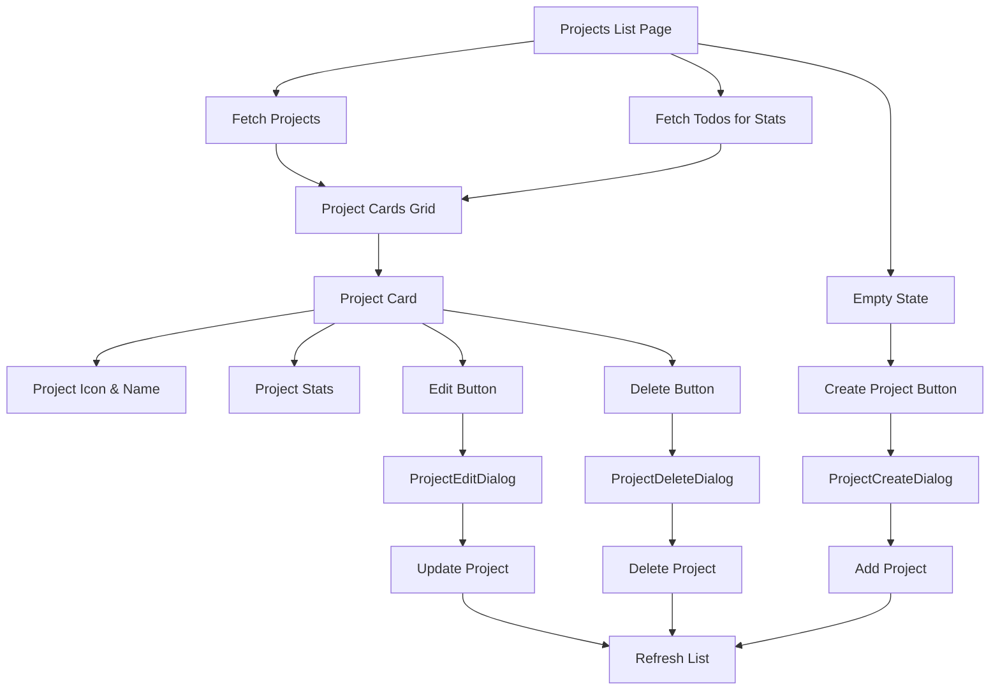

# Projects List Page Implementation Plan

## Overview
Build a projects list page at [`src/routes/(todo)/project/index.tsx`](src/routes/(todo)/project/index.tsx) that displays all projects with edit and delete actions, plus a create project button in the empty state. Includes search and filter functionality.

## Architecture



## Implementation Steps

### 1. Create ProjectCreateDialog Component
**File**: `src/components/project/project-create-dialog.tsx`

- Similar structure to [`ProjectEditDialog`](src/components/project/project-edit-dialog.tsx)
- Use `addProject` from [`src/services/project.ts`](src/services/project.ts)
- Form fields: name (required, max 50 chars), icon (emoji selector)
- Default icon: '🎯'
- Show "Create Project" dialog title
- On success: close dialog, show toast success message

### 2. Set up page structure
**File**: `src/routes/(todo)/project/index.tsx`

- Use `TodoListPageWrapper` for consistent layout
- Add page title "Projects"
- Import necessary components and hooks:
  - `useLiveQuery` from `dexie-react-hooks`
  - `ProjectEditDialog`, `ProjectDeleteDialog`, `ProjectStats`
  - `Card`, `Button`, `Empty`, `Input` components
  - `db` from `@/lib/db`
  - `addProject` from `@/services/project`
  - `RiSearchLine`, `RiFilterLine` from `@remixicon/react`

### 3. Fetch data with real-time updates
- Use `useLiveQuery` to fetch all projects: `db.projects.toArray()`
- Use `useLiveQuery` to fetch all todos for statistics: `db.todos.toArray()`
- Handle loading state (show skeleton or loading indicator)
- Handle empty state (show Empty component with Create button)

### 4. Create project card component
**Inline component in the page file**

- Display project icon (emoji) and name
- Show task statistics using `ProjectStats` component
- Add edit button (ghost variant, edit icon)
- Add delete button (ghost variant, destructive color, delete icon)
- Make card clickable to navigate to project detail page (`/project/$id`)
- Use `Card` component for consistent styling

### 5. Implement create functionality
- Add state for create dialog: `createDialogOpen`
- Open create dialog when "Create Project" button clicked
- Pass empty/default project data to `ProjectCreateDialog`
- Handle successful create with toast notification

### 6. Implement edit functionality
- Add state for edit dialog: `editDialogOpen`, `selectedProject`
- Open edit dialog when edit button clicked
- Pass selected project to `ProjectEditDialog`
- Handle successful edit with toast notification

### 7. Implement delete functionality
- Add state for delete dialog: `deleteDialogOpen`, `selectedProject`
- Open delete dialog when delete button clicked
- Pass selected project to `ProjectDeleteDialog`
- Handle successful delete with toast notification

### 8. Implement search functionality
- Add search input field at the top of the page
- Filter projects by name (case-insensitive)
- Show "No projects found" when search returns no results
- Clear search button when search is active

### 9. Implement filter functionality
- Add filter dropdown with options:
  - "All Projects" - show all projects
  - "Active Projects" - projects with pending todos
  - "Completed Projects" - projects with all todos completed
  - "Projects with Overdue" - projects with overdue todos
- Filter projects based on their todo statistics
- Show filter indicator when filter is active

### 10. Handle empty state
- Show `Empty` component when no projects exist
- Display helpful message: "No projects yet"
- Add "Create Project" button (primary variant)
- Optionally add an icon (e.g., folder icon)

### 11. Add responsive grid layout
- Use CSS Grid for project cards
- Responsive breakpoints:
  - Mobile: 1 column
  - Tablet: 2 columns
  - Desktop: 3 columns
- Proper spacing and gap (gap-4 or gap-6)

## Key Components to Use

### Existing Components
- [`ProjectEditDialog`](src/components/project/project-edit-dialog.tsx) - for editing projects
- [`ProjectDeleteDialog`](src/components/project/project-delete-dialog.tsx) - for deleting projects
- [`ProjectStats`](src/components/project/project-stats.tsx) - for displaying task statistics
- [`Card`](src/components/ui/card.tsx) - for project card container
- [`Button`](src/components/ui/button.tsx) - for action buttons
- [`Empty`](src/components/ui/empty.tsx) - for empty state display

### New Components
- `ProjectCreateDialog` - for creating new projects

## Data Flow

1. Page loads → Fetch all projects and todos
2. Calculate stats for each project (filter todos by projectId)
3. Apply search filter (if search query exists)
4. Apply status filter (if filter is selected)
5. Render filtered project cards in grid
6. User types in search → Filter projects in real-time
7. User selects filter → Filter projects by status
8. User clicks "Create Project" → Open create dialog → Add project → Refresh
9. User clicks edit → Open edit dialog → Update project → Refresh
10. User clicks delete → Open delete dialog → Delete project → Refresh
11. User clicks card → Navigate to `/project/$id`

## State Management

```typescript
const [createDialogOpen, setCreateDialogOpen] = useState(false)
const [editDialogOpen, setEditDialogOpen] = useState(false)
const [deleteDialogOpen, setDeleteDialogOpen] = useState(false)
const [selectedProject, setSelectedProject] = useState<ProjectType | null>(null)
const [searchQuery, setSearchQuery] = useState('')
const [filterType, setFilterType] = useState<'all' | 'active' | 'completed' | 'overdue'>('all')
```

## Filter Types

```typescript
type ProjectFilterType = 'all' | 'active' | 'completed' | 'overdue'

// Filter logic:
// - 'all': Show all projects
// - 'active': Projects with at least one pending todo
// - 'completed': Projects where all todos are completed (or no todos)
// - 'overdue': Projects with at least one overdue todo
```

## Styling Considerations

- Follow existing design system (rounded-4xl, muted colors)
- Use hover effects on cards (subtle background change)
- Proper spacing and typography
- Responsive design for mobile/tablet/desktop
- Consistent with [`project/$id.tsx`](src/routes/(todo)/project/$id.tsx) styling

## ProjectCreateDialog Component Structure

```typescript
type ProjectCreateDialogPropsType = {
  open: boolean
  onOpenChange: (open: boolean) => void
  onCreateSuccess?: () => void
}

// Form fields:
// - name: string (required, max 50 chars)
// - icon: string (emoji selector, default '🎯')

// On submit:
// - Call addProject({ name, icon })
// - Show toast.success('Project created successfully')
// - Call onCreateSuccess callback
// - Close dialog
```

## Search Bar Design

```tsx
<div className="flex items-center gap-2 mb-6">
  <div className="relative flex-1">
    <RiSearchLine className="absolute left-3 top-1/2 -translate-y-1/2 size-4 text-muted-foreground" />
    <Input
      placeholder="Search projects..."
      value={searchQuery}
      onChange={(e) => setSearchQuery(e.target.value)}
      className="pl-9"
    />
    {searchQuery && (
      <Button
        size="icon-xs"
        variant="ghost"
        className="absolute right-1 top-1/2 -translate-y-1/2"
        onClick={() => setSearchQuery('')}
      >
        <RiCloseLine />
      </Button>
    )}
  </div>
  <DropdownMenu>
    <DropdownMenuTrigger asChild>
      <Button variant="outline" size="icon">
        <RiFilterLine />
      </Button>
    </DropdownMenuTrigger>
    <DropdownMenuContent align="end">
      <DropdownMenuItem onClick={() => setFilterType('all')}>
        All Projects
      </DropdownMenuItem>
      <DropdownMenuItem onClick={() => setFilterType('active')}>
        Active Projects
      </DropdownMenuItem>
      <DropdownMenuItem onClick={() => setFilterType('completed')}>
        Completed Projects
      </DropdownMenuItem>
      <DropdownMenuItem onClick={() => setFilterType('overdue')}>
        Projects with Overdue
      </DropdownMenuItem>
    </DropdownMenuContent>
  </DropdownMenu>
</div>
```

## Empty State Design

```tsx
<Empty>
  <EmptyHeader>
    <EmptyMedia variant="icon">
      {/* Folder or project icon */}
    </EmptyMedia>
    <EmptyTitle>No projects yet</EmptyTitle>
    <EmptyDescription>
      Create your first project to start organizing your tasks
    </EmptyDescription>
  </EmptyHeader>
  <Button onClick={() => setCreateDialogOpen(true)}>
    Create Project
  </Button>
</Empty>
```

## Project Card Design

```tsx
<Card 
  className="cursor-pointer hover:bg-muted/50 transition-colors"
  onClick={() => navigate({ to: '/project/$id', params: { id: project.id } })}
>
  <CardHeader>
    <div className="flex items-center gap-3">
      {project.icon && <span className="text-3xl">{project.icon}</span>}
      <CardTitle>{project.name}</CardTitle>
    </div>
    <CardAction>
      <Button 
        size="icon-sm" 
        variant="ghost"
        onClick={(e) => {
          e.stopPropagation()
          handleEdit(project)
        }}
      >
        <RiEditLine />
      </Button>
      <Button 
        size="icon-sm" 
        variant="ghost"
        className="text-destructive"
        onClick={(e) => {
          e.stopPropagation()
          handleDelete(project)
        }}
      >
        <RiDeleteBinLine />
      </Button>
    </CardAction>
  </CardHeader>
  <CardContent>
    <ProjectStats todos={projectTodos} />
  </CardContent>
</Card>
```

## Dependencies

- `@tanstack/react-router` - for navigation
- `dexie-react-hooks` - for real-time data fetching
- `sonner` - for toast notifications
- `@remixicon/react` - for icons (RiEditLine, RiDeleteBinLine, RiFolderLine)
- `date-fns` - for date calculations (if needed)

## Testing Checklist

- [ ] Projects load and display correctly
- [ ] Empty state shows when no projects exist
- [ ] "Create Project" button opens create dialog
- [ ] Create project adds new project to list
- [ ] Edit button opens edit dialog with correct data
- [ ] Edit project updates project in list
- [ ] Delete button opens delete dialog
- [ ] Delete project removes project from list
- [ ] Clicking card navigates to project detail page
- [ ] Stats display correctly for each project
- [ ] Responsive layout works on mobile/tablet/desktop
- [ ] Search filters projects by name in real-time
- [ ] Clear search button removes search query
- [ ] Filter dropdown shows all filter options
- [ ] "All Projects" filter shows all projects
- [ ] "Active Projects" filter shows projects with pending todos
- [ ] "Completed Projects" filter shows projects with all todos completed
- [ ] "Projects with Overdue" filter shows projects with overdue todos
- [ ] Search and filter work together correctly
- [ ] "No projects found" shows when search/filter returns no results
